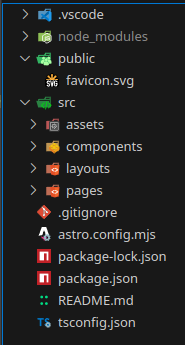

# Astro SpaceX Launches 

## Intro + ¿Qué es Astro?

Astro es un framework web **para crear todo tipo de webs**.

Aunque en sus inicios estaba pensado para páginas estáticas, resulta que poco a poco ha ido evolucionando hasta el punto de que a día de hoy podemos hacer cualquier tipo de página web.

Astro es rápido por 2 motivos:

1. La experiencia de desarrollo es muy buena
2. Las páginas web con Astro van muy rápidas

## Magia de Astro

Astro se basa en una **arquitectura de islas**.

Es un tipo de  arquitectura en el Front-End que lo que busca es que si toda la página es estática, pero hay alguna parte que es dinámica, lo que hace Astro es que para dicha parte dinámica crea una isla dinámica, de forma que toda la parte de mi página que es estática no cargo JavaScript salvo para dicha isla.

Por defecto Astro no carga JavaScript en el cliente, lo cual es espectacular.

## Agnóstico al Framework

Otro punto clave de Astro es que agnóstico a la biblioteca de UI que quieras utilizar, es decir, no está atado a ninguna bibliteca, lo podemos usar con nuestro framework de confianza favorito.

Aunque no es obligatorio usar ninguna biblioteca de UI.

## Plantillas

Existen un montón de plantillas ya preparadas en la web de Astro, 

## Estructura de carpetas



## Sintaxis

En Astro el bloque encerrado con - - - es donde podemos escribir JavaScript.

Es decir, ahí haremos los imports de los componentes, fetching de datos, decir las props…

Otra cosa interesante de Astro es que los estilos que declaramos dentro de <style> tienen scope, es decir, están siendo utilizados únicamente sobre el propio componente.

## Props

Astro cuenta con una variable global llamada “Astro” que podemos usar en todos los archivos .astro y que contiene diversa información como los props, las cookies, parámetros, nos da la posibilidad de redirigir, informacion del sitio, etc.

En Astro podemos definir los props así:

```jsx
---
// Usage: <GreetingHeadline greeting="Howdy" name="Partner" />
const { greeting, name } = Astro.props;
---
<h2>{greeting}, {name}!</h2>
```

Los cuales se usan así:

```jsx
---
import GreetingHeadline from './GreetingHeadline.astro';
const name = 'Astro';
---
<h1>Greeting Card</h1>
<GreetingHeadline greeting="Hi" name={name} />
<p>I hope you have a wonderful day!</p>
```

Pero también nos permite definir los props usando TypeScript con un tipo de interfaz llamada Props, que es lo que vamos a hacer nosotros:

```jsx
---
interface Props {
  name: string;
  greeting?: string;
}

const { greeting = "Hello", name } = Astro.props;
---
<h2>{greeting}, {name}!</h2>
```

Por supuesto a los props les podemos poner valores por defecto:

```jsx
---
const { greeting = "Hello", name = "Astronaut" } = Astro.props;
---
<h2>{greeting}, {name}!</h2>
```

En nuestra aplicación vamos a crear un prop para el Layout de forma que podamos pasarle el title. Layout.astro:

```jsx
---
import "../styles/global.css"

interface Props {
	title: string
}

const { title } = Astro.props;

---

<!doctype html>
<html lang="en">
	<head>
		<meta charset="UTF-8" />
		<meta name="viewport" content="width=device-width" />
		<link rel="icon" type="image/svg+xml" href="/favicon.svg" />
		<meta name="generator" content={Astro.generator} />
		<title>{title}</title>
	</head>
	<body>
		<slot />
	</body>
</html>

<style>
	html,
	body {
		margin: 0;
		width: 100%;
		height: 100%;
		background-color: black;
		color: white;
	}
</style>
```

De forma que en el index.astro usamos el layout estableciendo el title por medio del prop:

```jsx
---
import Layout from '../layouts/Layout.astro';
---

<Layout title="SpaceX Launches">
	<main>
	</main>
</Layout>

```

## CSS Directivas

En Astro podemos hacer estilos globales, con <style is:global>.

Con <style is:inline> dejaríamos el estilo en el HTML para no procesarlo.

Pero con <style> lo estaríamos procesando y haciendo que sólo funcione en el propio componente.

## Componentes y npm run dev

Una de las cosas buenas que tiene Astro es que no tiene casi boilerplate, es decir, te ahorra código a la hora de crear componentes, ya que no tienes que poner export function ni nada, por lo que nos evita ese código repetitivo a la hora de crear componentes.

Obviamente Astro ya tiene todo lo que sería fast refresh, hot mode replacement, por lo que guardas y ya ves directamente los cambios.

## Dist: Despligue a producción

Si hacemos npm run build y accedemos al directorio generado dist, veremos que no hay ningún archivo de JavaScript, ya que como hemos comentado anteriormente por defecto no utiliza JavaScript.


## Sistema de Integración

En Astro existe un sistema de integración que simplemente ejecutando un comando nos permite añadir nuestros frameworks de referencia.

En este caso, vamos a instalar TailwindCSS:

## Primer componente

Vamos a crear nuestro primer componente, concretamente el header de nuestra aplicación en un archivo llamado Header.astro en el directorio components:

```jsx
---
console.log('javascript')
---

<header class="py-8 px-4 mx-auto max-w-xl lg:py-16 lg:px-6">
  <div class="mx-auto text-center mb-8 lg:mb-16">
    <h2 class="mb-4 text-5xl tracking-tight font-extrabold text-white">
      SpaceX launches 🚀
    </h2>
    <p class="font-light text-gray-500 sm:text-xl dark:text-gray-400">
      All the information about SpaceX launches
    </p>
  </div>

  <nav class="flex flex-col items-center justify-between w-full text-center md:flex-row">
    <a class="text-white" href="/">Últimos lanzamientos</a>
    <a class="text-white" href="/oldest">Los más viejos</a>
  </nav>
</header>
```

De momento nuestra aplicación luce así:


## Enrutamiento de páginas / Layout

Ahora vamos a tratar de conseguir que en todas las páginas se vea el mismo header que acabamos de crear.

index.astro

```jsx
---
import Layout from '../layouts/Layout.astro';
---

<Layout title="SpaceX Launches">
	La página principal
</Layout>

```

about.astro

```jsx
---
import Layout from "../layouts/Layout.astro"
---

<Layout title="About the project">
  <h1>About the project</h1>
  
  <p>The SpaceX launches project is a demo for the Astro course</p>
</Layout>
```

Layout.astro

```jsx
---
import Header from "../components/Header.astro";
import "../styles/global.css"

interface Props {
	title: string
}

const { title } = Astro.props;

---

<!doctype html>
<html lang="en">
	<head>
		<meta charset="UTF-8" />
		<meta name="viewport" content="width=device-width" />
		<link rel="icon" type="image/svg+xml" href="/favicon.svg" />
		<meta name="generator" content={Astro.generator} />
		<title>{title}</title>
	</head>
	<body class="bg-gray-900 min-h-screen pb-32">
		<Header />
		<main class="max-w-5xl px-4 m-auto">
			<slot />
		</main>
	</body>
</html>

<style is:global>
	html{
		color-scheme: dark light; /* Con esta propiedad indicamos que queremos usar el modo oscuro y que todos los colores se adecuen al modo oscuro */
	}
</style>

```

¡Ojo con esto! Que la propiedad color-scheme no te establece el color del texto.


## Slots (nombrados, text by default)

Vamos a ver cómo funciona el tema de los slots, porque es mucho más potente de lo que parece.

No solo es el tema del children.

Y es que los slots en Astro pueden estar nombrados, es decir, podemos agregar nombre al slot.

Para mostrar su potencial vamos a ver un ejemplo en el que con 2 slots nombrados podemos indicar en qué posición se tiene que poner, es decir, le decimos que asigne dicho elemento svg al hueco que tiene el nombre “before” o “after”.

Creamos un nuevo componente HeaderButton.astro

```jsx
---
interface Props {
  href: string;
}

const { href } = Astro.props;
---

<a href={href}
class="flex-row justify-center text-white cursor-pointer
hover:bg-slate-700 focus:ring-4 focus:outline-none focus:ring-[#1da1f2]/50
font-medium rounded-lg px-5 py-2.5 text-center inline-flex items-center
dark:focus:ring-[#1da1f2]/55 mr-2 mb-2 hover:shadow-lg transition-all
duration-200 ease-in-out hover:scale-110 scale-90 gap-x-2 opacity-70
hover:opacity-100">
  <slot name="before" />
  <slot />
  <slot name="after" />
</a>
```

Y en el Header.astro

```jsx
---
import HeaderButton from "./HeaderButton.astro"

console.log('javascript')
---

<header class="py-8 px-4 mx-auto max-w-xl lg:py-16 lg:px-6">
  <div class="mx-auto text-center mb-8 lg:mb-16">
    <h2 class="mb-4 text-5xl tracking-tight font-extrabold text-white">
      SpaceX launches 🚀
    </h2>
    <p class="font-light text-gray-500 sm:text-xl dark:text-gray-400">
      All the information about SpaceX launches
    </p>
  </div>

  <nav class="flex flex-col items-center justify-between w-full text-center md:flex-row">
    <HeaderButton href="/">
      <svg 
        slot="before"
        width="24"
        height="24"  
        viewBox="0 0 24 24"  
        fill="none"  
        stroke="currentColor"  
        stroke-width="2"  
        stroke-linecap="round"  
        stroke-linejoin="round"  
      >
        <path stroke="none" d="M0 0h24v24H0z" fill="none"/>
        <path d="M4 13a8 8 0 0 1 7 7a6 6 0 0 0 3 -5a9 9 0 0 0 6 -8a3 3 0 0 0 -3 -3a9 9 0 0 0 -8 6a6 6 0 0 0 -5 3" />
        <path d="M7 14a6 6 0 0 0 -3 6a6 6 0 0 0 6 -3" />
        <path d="M15 9m-1 0a1 1 0 1 0 2 0a1 1 0 1 0 -2 0" />
      </svg>
      Últimos lanzamientos
    </HeaderButton>
    <HeaderButton href="/about">
      <!-- Con slot estamos indicando en qué posición queremos que se coloque el icono utilizando slots nombrados -->
      <svg
        slot="before" 
        width="24"  
        height="24" 
        viewBox="0 0 24 24" 
        fill="none"  
        stroke="currentColor"
        stroke-width="2" 
        stroke-linecap="round" 
        stroke-linejoin="round"
      >
          <path stroke="none" d="M0 0h24v24H0z" fill="none"/>
          <path d="M3 12a9 9 0 1 0 18 0a9 9 0 0 0 -18 0" />
          <path d="M12 9h.01" />
          <path d="M11 12h1v4h1" />
      </svg>
      Sobre el proyecto
    </HeaderButton>
    <HeaderButton href="/oldest">
      <svg 
        slot="before"
        width="24"
        height="24"  
        viewBox="0 0 24 24"  
        fill="none"  
        stroke="currentColor"  
        stroke-width="2"  
        stroke-linecap="round"  
        stroke-linejoin="round"  
      >
        <path stroke="none" d="M0 0h24v24H0z" fill="none"/>
        <path d="M20.984 12.535a9 9 0 1 0 -8.431 8.448" />
        <path d="M12 7v5l3 3" /><path d="M19 16v6" />
        <path d="M22 19l-3 3l-3 -3" />
      </svg>
      Los más viejos
    </HeaderButton>
  </nav>
</header>
```


Una cosa que debemos saber de los slots es el tema del contenido por defecto, imáginate que por lo que sea el slot no recibe nada y queremos tener un valor por defecto, para ello lo que podemos hacer es poner un texto por defecto, o html o un componente ahí, o lo que tú quieras, entonces lo que va a hacer esto es que en caso de no le pasemos un slot:

HeaderButton.astro

```jsx
<a class="flex-row justify-center text-white cursor-pointer
hover:bg-slate-700 focus:ring-4 focus:outline-none focus:ring-[#1da1f2]/50
font-medium rounded-lg px-5 py-2.5 text-center inline-flex items-center
dark:focus:ring-[#1da1f2]/55 mr-2 mb-2 hover:shadow-lg transition-all
duration-200 ease-in-out hover:scale-110 scale-90 gap-x-2 opacity-70
hover:opacity-100">
  <slot name="before" />
  <slot>Un texto por defecto</slot>
  <slot name="after" />
</a>
```

Header.astro donde hemos quitado el texto que estába en la zona marcada en rojo al último HeaderButton:


Resultado:


<aside>
💡

Esto del contenido por defecto, se puede hacer tanto para los slots nombrados como para los normales.

</aside>

## Markdown (.md)

Astro es totalmente compatible con Markdown, de cero, sin instalar nada.

En los archivos Markdown se puede usar una cosa llamada front matter que nos permite indicar características, en este caso vamos a indicar el title y el layout que queremos que utilice:

```markdown
---
  title: 'Contenido de la página'
  layout: "../layouts/Layout.astro"
---

# Esto es un ejemplo de artículo

lorem ipsum dolor sit amet, consectetur adipiscing elit. 

## Subtítulo

lorem ipsum dolor sit amet, consectetur adipiscing elit.

## Subtítulo 2

```javascript
function () {
    console.log('Hola mundo');
}
```
```

Astro además tiene una cosa llamada Content Collections que está pensado para casos en los que casi todo tu contenido va a ser con Markdown. 

Y nos permite definir colecciones, qué campos tienen las colecciones, decirle cuál es el esquema (schema), es decir, para poder definir qué campos necesitamos en el front matter, si hay que pasar una imágen, si hay que poner tags, además le podemos definir qué layour por defecto está utilizando. 

Y lo mejor es que podemos tener diferentes colecciones, para los posts del blog, para autores, para archivos, vídeos, podcast. 

## Usar HTML

En Astro podemos usar HTML.

Cremos un archivo ejemplo.html dentro del directorio pages:

```markdown
<h1>
  Un ejemplo de html 
</h1>
```


## Fetching de Datos / Iteración de elementos

Vamos a crear un nuevo componente para los launches y de paso vamos a ver cómo hacemos fetching de datos.

<aside>
💡

Astro no ejecuta nada de JavaScript en la parte del cliente, lo hace en la parte del servidor o en tiempo de compilación.

</aside>

```jsx
---
const res = await fetch('https://api.spacexdata.com/v5/launches/query', {
  method: 'POST',
  headers: {
    'Content-Type': 'application/json',
  },
  body: JSON.stringify({
    query: {},
    options: {
      sort: {
          date_unix: "asc", // Ordenar por fecha de forma ascendente (date_unix es un campo del json devuelto)
      },
      limit: 12,
    },
  }),
});

const data = await res.json();

console.log(data);
---

<div class="grid gap-8 sm:grid-cols-2 lg:grid-cols-3">
  <article>
    
  </article>
</div>
```

## Tipos en TypeScript

Vamos a usar quicktype para tener tipado en el json para cuando accedamos a los datos.

Para ello nos copiamos la salida por terminal del console.log(data), nos vamos a quicktype y le decimos que lo pase a TypeScript con las 3 opciones que he marcado:


Nos copiamos el código haciendo click en “Copy Code” y lo pasamos a un nuevo archivo llamado “api.ts” dentro un directorio nuevo en src llamado “types”:

```tsx
export type APISpaceXResponse = {
    docs:          Doc[];
    totalDocs:     number;
    offset:        number;
    limit:         number;
    totalPages:    number;
    page:          number;
    pagingCounter: number;
    hasPrevPage:   boolean;
    hasNextPage:   boolean;
    prevPage:      null;
    nextPage:      number;
}

export type Doc = {
    fairings:              Fairings | null;
    links:                 Links;
    static_fire_date_utc:  Date | null;
    static_fire_date_unix: number | null;
    net:                   boolean;
    window:                number;
    rocket:                Rocket;
    success:               boolean;
    failures:              Failure[];
    details:               null | string;
    crew:                  any[];
    ships:                 string[];
    capsules:              string[];
    payloads:              string[];
    launchpad:             Launchpad;
    flight_number:         number;
    name:                  string;
    date_utc:              Date;
    date_unix:             number;
    date_local:            Date;
    date_precision:        DatePrecision;
    upcoming:              boolean;
    cores:                 Core[];
    auto_update:           boolean;
    tbd:                   boolean;
    launch_library_id:     null;
    id:                    string;
}

export type Core = {
    core:            string;
    flight:          number;
    gridfins:        boolean;
    legs:            boolean;
    reused:          boolean;
    landing_attempt: boolean;
    landing_success: boolean | null;
    landing_type:    null | string;
    landpad:         null;
}

export enum DatePrecision {
    Hour = "hour",
}

export type Failure = {
    time:     number;
    altitude: number | null;
    reason:   string;
}

export type Fairings = {
    reused:           boolean | null;
    recovery_attempt: boolean | null;
    recovered:        boolean | null;
    ships:            any[];
}

export enum Launchpad {
    The5E9E4501F509094Ba4566F84 = "5e9e4501f509094ba4566f84",
    The5E9E4502F509092B78566F87 = "5e9e4502f509092b78566f87",
    The5E9E4502F5090995De566F86 = "5e9e4502f5090995de566f86",
}

export type Links = {
    patch:      Patch;
    reddit:     Reddit;
    flickr:     Flickr;
    presskit:   null | string;
    webcast:    string;
    youtube_id: string;
    article:    string;
    wikipedia:  string;
}

export type Flickr = {
    small:    any[];
    original: any[];
}

export type Patch = {
    small: string;
    large: string;
}

export type Reddit = {
    campaign: null;
    launch:   null | string;
    media:    null;
    recovery: null;
}

export enum Rocket {
    The5E9D0D95Eda69955F709D1Eb = "5e9d0d95eda69955f709d1eb",
    The5E9D0D95Eda69973A809D1Ec = "5e9d0d95eda69973a809d1ec",
}

```

Esto es una buena idea porque ahora tenemos autocompletado y es más fácil manejar la información recibida.

Ahora vamos a crear un componente para mostrar las “cartas de los lanzamientos”.

CardLaunch.astro

```jsx
---
interface Props {
  id: string
  name: string
  img: string
  success: boolean
  flightNumber: number
  details: string
}

const { success, flightNumber, img, id, details } = Astro.props
const successText = success ? "Éxito" : "Fracaso"
---

<a href={`/launch/${id}`}
  class="rounded-lg border shadow-md bg-gray-800 border-gray-700
  hover:scale-105 hover:bg-gray-700 hover:border-gray-500 transition flex flex-col"
>
  <picture class="flex justify-center p-4">
    
  </picture>

  <header class="p-4 flex-grow">
    <span class={`text-xs font-semibold mr-2 px-2.5 py-0.5 rounded ${success ? "bg-green-200 text-green-900" : "bg-red-200 text-red-900"}`}>
      {successText}
    </span>

    <h2 class="my-2 text-2xl font-bold tracking-tight text-white">
      Flight #{flightNumber}
    </h2>

    <p class="mb-4 font-light text-gray-400">
      {details?.length > 100 ? details.slice(0, 100) + "..." : details}
    </p>
  </header>
</a>
```

Recorremos el array de lanzamientos y mostramos la imagen y el título de cada uno en Launches.astro:

```jsx
---
import { type APISpaceXResponse } from "../types/api";

const res = await fetch('https://api.spacexdata.com/v5/launches/query', {
  method: 'POST',
  headers: {
    'Content-Type': 'application/json',
  },
  body: JSON.stringify({
    query: {},
    options: {
      sort: {
          date_unix: "asc", // Ordenar por fecha de forma ascendente (date_unix es un campo del json devuelto)
      },
      limit: 12,
    },
  }),
});

const { docs: launches } = (await res.json()) as APISpaceXResponse;
---

<div class="grid gap-8 sm:grid-cols-2 lg:grid-cols-3">
  {
    launches.map((launch) => (
      <article>
        
        <h2>Launch #{launch.id}</h2>
      </article>
    ))
  }
</div>
```

Estado actual de la aplicación:


## Estilando Card para mostrar información

CardLaunch.astro

```jsx
---
interface Props {
  id: string
  details: string | null
  img: string
  success: boolean
  flightNumber: number
}

const { success, flightNumber, img, id, details } = Astro.props
const successText = success ? "Éxito" : "Fracaso"
---

<a href={`/launch/${id}`}
  class="rounded-lg border shadow-md bg-gray-800 border-gray-700
  hover:scale-105 hover:bg-gray-700 hover:border-gray-500 transition flex flex-col"
>
  <picture class="flex justify-center p-4">
    
  </picture>

  <header class="p-4 flex-grow">
    <span class={`text-xs font-semibold mr-2 px-2.5 py-0.5 rounded`}>
      Por hacer
    </span>

    <h2 class="my-2 text-2xl font-bold tracking-tight text-white">
      Flight #{flightNumber}
    </h2>

    <p class="mb-4 font-light text-gray-400">
      {details != null && details?.length > 100 ? details.slice(0, 100) + "..." : details}
    </p>
  </header>
</a>
```

Launches.astro

```jsx
---
import { type APISpaceXResponse } from "../types/api";
import CardLaunch from "../components/CardLaunch.astro";

const res = await fetch('https://api.spacexdata.com/v5/launches/query', {
  method: 'POST',
  headers: {
    'Content-Type': 'application/json',
  },
  body: JSON.stringify({
    query: {},
    options: {
      sort: {
          date_unix: "asc", // Ordenar por fecha de forma ascendente (date_unix es un campo del json devuelto)
      },
      limit: 12,
    },
  }),
});

const { docs: launches } = (await res.json()) as APISpaceXResponse;
---

<div class="grid gap-8 sm:grid-cols-2 lg:grid-cols-3">
  {
    launches.map(
      ({id, links, details, flight_number: flightNumber, success}) => (
        <CardLaunch
          id={id}
          img={links.patch.small}
          details={details}
          flightNumber={flightNumber}
          success={success}
        />
      ) 
    )
  }
</div>
```

Estado actual de la aplicación:


## Renderizado condicional

En Astro existe una utilidad llamada class:list a la cual le podemos pasar un array en el que indicamos por ejemplo, qué clases de Tailwind se aplicarán siempre y cuales de forma condicional.

Esto nos ahorra tener que usar un template string y además queda de una forma más declarativa.

CardLaunch.astro

```jsx
---
interface Props {
  id: string
  details: string | null
  img: string
  success: boolean
  flightNumber: number
}

const { success, flightNumber, img, id, details } = Astro.props
const launchStatus = success ? "Success" : "Failure"
---

<a href={`/launch/${id}`}
  class="rounded-lg border shadow-md bg-gray-800 border-gray-700
  hover:scale-105 hover:bg-gray-700 hover:border-gray-500 transition flex flex-col"
>
  <picture class="flex justify-center p-4">
    
  </picture>

  <header class="p-4 flex-grow">
    <span
      class:list={[
        "text-xs font-semibold mr-2 px-2.5 py-0.5 rounded",
        {
          "bg-green-400 text-green-900": success,
          "bg-red-400 text-red-900": !success
        }
      ]}
      >{launchStatus}
    </span>

    <h2 class="my-2 text-2xl font-bold tracking-tight text-white">
      Flight #{flightNumber}
    </h2>

    <p class="mb-4 font-light text-gray-400">
      {details != null && details?.length > 100 ? details.slice(0, 100) + "..." : details}
    </p>
  </header>
</a>
```

Estado actual de la aplicación:


## 404.Astro

Obviamente si hacemos click en uno de los launches las páginas todavía no funcionan:


Así que vamos a configurar una página para el error 404:

```jsx
---
import Layout from '../layouts/Layout.astro';
---

<Layout title="404 Not Found">
  <div class="flex flex-col justify-center items-center">
    <h1 class="text-white text-3xl text-center">Esta página no existe...</h1>
    
  </div>
</Layout>
```

Resultado:


## Dudas

**¿En qué momento sabes que debes agregar un framework como Vue o React?**

Cuando necesitas interactividad.

**¿Cómo se hace para que el fetching de datos se actualice, ya que desplegado obtendrá los datos una vez, en el momento de la compilación?**

De momento con todo lo que hemos implementado, si hiciéramos un npm run build, en el directorio dist habrá 0 JavaScript, es simplemente estático, entonces claro, eso significa que cada vez que queramos que los datos se actualicen, tendremos que hacer otro despliegue a producción para poder los nuevos cambios, es decir, otro npm run build, porque en el html generado no hay nada de JavaScript para traerse los datos actualizados.

Lo que habría que hacer es simplemente ir haciendo despliegue cada 5, 10, dependiendo de lo que queramos hacer.

Aunque también es cierto que podemos tener un modo de Server Sider Rendering (SSR) y podemos cachear y todo esto.

También muchas veces podemos hacer cosas estáticas, y con una github action o lo que sea podemos hacer que se vaya refrescando y regenerando el deploy, cada 5, 10, 30 minutos, dependiendo del caso, pero no tiene esa granularidad de decir a nivel de página que haga un revalidate y tal, para eso necesitaríamos ya el modo de servidor.

Nota: Se puede desplegar Astro en cualquier hosting en el modo servidor o en el modo estático, de hecho en el modo estático esto sería directamente arrastrar los ficheros y lo tendríamos.

## Páginas dinámicas (getStaticPaths)

Vamos a pasar el fetching de datos a una nueva carpeta llamada “services”, en un nuevo archivo llamado “spacex.ts”, de forma que podamos reutilizar dicha implementación donde queramos, y además vamos a añadir la lógica para recuperar un launch por id.

spacex.ts

```tsx
import { type Doc, type APISpaceXResponse } from "../types/api";

export const getLaunchById = async ({id}: {id: string}) => {
  const res = await fetch(`https://api.spacexdata.com/v5/launches/${id}`) 
  
  const launch = (await res.json()) as Doc;
  return launch
} 

export const getLatestLaunches = async () => {
  const res = await fetch('https://api.spacexdata.com/v5/launches/query', {
    method: 'POST',
    headers: {
      'Content-Type': 'application/json',
    },
    body: JSON.stringify({
      query: {},
      options: {
        sort: {
            date_unix: "asc", // Ordenar por fecha de forma ascendente (date_unix es un campo del json devuelto)
        },
        limit: 12,
      },
    }),
  });
  
  const { docs: launches } = (await res.json()) as APISpaceXResponse;
  return launches
} 
```

Launches.astro

```jsx
---
import CardLaunch from "../components/CardLaunch.astro";
import { getLatestLaunches } from "../services/spacex";

const launches = await getLatestLaunches();
---

<div class="grid gap-8 sm:grid-cols-2 lg:grid-cols-3">
  {
    launches.map(
      ({id, links, details, flight_number: flightNumber, success}) => (
        <CardLaunch
          id={id}
          img={links.patch.small}
          details={details}
          flightNumber={flightNumber}
          success={success}
        />
      ) 
    )
  }
</div>
```

Vamos a crear una página con una ruta dinámica.

[id].astro

```jsx
---
import Layout from "../../layouts/Layout.astro"
import { getLatestLaunches, getLaunchById } from "../../services/spacex"

const { id } = Astro.params

/*
if (!id) { // solo para el servidor
  Astro.redirect("/")
}
*/

let launch = null
if (id) {
  launch = await getLaunchById({ id })
}

export async function getStaticPaths() {
  // llamar a una API externa para saber todas las ids que debes generar

  const launches = await getLatestLaunches()

  return launches.map(launch => ({
    params: { id: launch.id }
  }))
}

---

<Layout title={`Lanzamiento ${id}`}>
  <article>
    {launch?.id}
  </article>
</Layout>
```

Lo que marco en azul es correcto para cuando antes de que el usuario entre a la página conoces todas las páginas, servicios, productos que quieres servir y son limitados. Que pueden ser decenas, centenas, pero que no son ilimitados, es un número finito y conocido antes de que el usuario pueda navegar.

Por ejemplo, una tienda online que tenga 50 productos, pues tiene todo el sentido del mundo que hagamos lo marcado en azul, porque vas a generar 50 páginas, es decir, cuando hagamos npm run build, se van a generar 50 páginas estáticas y claro el contenido va a cargar superrápido, pero claro lo malo es que si fuesen 5 millones de productos no tendría sentido.

En resumen, esto sería correcto para un número finito y conocido antes de que el usuario entre.

No tiene sentido por ejemplo para una página que sea dinámica, es decir, que esté constantemente cambiando, como por ejemplo twitter. Porque en ese caso, los tweets son muy dinámicos, no paran de crearse, estaría constantemente creando páginas estáticas y no terminaría nunca. No tiene sentido.

Entonces, ¿Qué podemos hacer en el caso en que no queramos hacer esto?

Puesto que esta sería la forma estática. Pero Astro también puede funcionar en el servidor.

## Páginas dinámicas (forma SSR)

<aside>
💡

**Removed: `hybrid` rendering mode**

In Astro v4.x, Astro provided three rendering `output` rendering modes: `'static'`, `'hybrid'`, and `'server'`

Astro v5.0 merges the `output: 'hybrid'` and `output: 'static'` configurations into one single configuration (now called `'static'`) that works the same way as the previous hybrid option.

It is no longer necessary to specify `output: 'hybrid'` in your Astro config to use server-rendered pages. The new `output: 'static'` has this capability included.

Astro will now automatically allow you to opt out of prerendering in your static site with no change to your output configuration required. Any page route or endpoint can include `export const prerender = false` to be server-rendered on demand, while the rest of your site is statically generated.

</aside>

Como hemos dicho no es obligatorio funcionar siempre de forma estática con Astro.

Por ello vamos a ver cómo activar en Astro el modo servidor o SSR.

**¿Cuáles podríamos tener?**

Podríamos tener el modo server para que sea 100% server side, pero si por lo que sea hay una parte que sí que te interesa que sea estática y otra parte que te interesa que sea dinámica, existe un modo llamado “hybrid”, **que tras la actualización a Astro 5 es el modo por defecto y lo mismo que el modo static**.

Por defecto se prerenderiza como hemos visto hasta ahora de forma estática, pero puedes optar por salir de esto para cada una de las páginas.

Es decir, si queremos que una página funcione en modo servidor, sólo tendríamos que indicarle en la parte - - -, la siguiente línea de código:

```jsx
export const prerender = false // server side rendering
```

Pero ahora vamos a probar el modo server:

```jsx
// @ts-check
import { defineConfig } from 'astro/config';

import tailwindcss from '@tailwindcss/vite';

// https://astro.build/config
export default defineConfig({
  vite: {
    plugins: [tailwindcss()]
  },
  output: 'server'
});
```

Y ahora como se puede ver ya no nos hace falta la función getStaticPaths en [id].astro

```jsx
---
import Layout from "../../layouts/Layout.astro"
// import { getLatestLaunches, getLaunchById } from "../../services/spacex"
import { getLaunchById } from "../../services/spacex"

const { id } = Astro.params

/*
if (!id) { // solo para el servidor
  Astro.redirect("/")
}
*/

let launch = null
if (id) {
  launch = await getLaunchById({ id })
}

/*
export async function getStaticPaths() {
  // llamar a una API externa para saber todas las ids que debes generar

  const launches = await getLatestLaunches()

  return launches.map(launch => ({
    params: { id: launch.id }
  }))
}
*/
---

<Layout title={`Lanzamiento ${id}`}>
  <article class="flex flex-col gap-y-4">
    
    <h2 class="text-4xl text-white font-bold">
      Launch #{launch?.flight_number}
    </h2>
    <p class="text-lg">{launch?.details}</p>
  </article>
</Layout>
```

Si entramos a una de las páginas de lanzamiento:


Pero claro, esto esta funcionando ahora en el servidor, y estamos perdiendo bastantes cosas positivas de Astro, pero funcionar funciona, y esto implica que podemos utilizar Astro para crear aplicaciones tan complicadas como queramos.

## Hybrid

Ahora si queremos lo mejor de los 2 mundos, tendremos que utilizar el `hybrid` mode, **que tras la actualización a Astro 5 es el modo por defecto y lo mismo que el modo static**.

Pero como en la versión 5 el modo hybrid es el modo por defecto, borramos el output: ‘server’ del archivo de configuración de Astro.

```tsx
// @ts-check
import { defineConfig } from 'astro/config';

import tailwindcss from '@tailwindcss/vite';

// https://astro.build/config
export default defineConfig({
  vite: {
    plugins: [tailwindcss()]
  }
});
```

[id].astro

```jsx
---
import Layout from "../../layouts/Layout.astro"
import { getLatestLaunches, getLaunchById } from "../../services/spacex"

const { id } = Astro.params

/*
if (!id) { // solo para el servidor
  Astro.redirect("/")
}
*/

let launch = null
if (id) {
  launch = await getLaunchById({ id })
}

export async function getStaticPaths() {
  // llamar a una API externa para saber todas las ids que debes generar

  const launches = await getLatestLaunches()

  return launches.map(launch => ({
    params: { id: launch.id }
  }))
}
---

<Layout title={`Lanzamiento ${id}`}>
  <article class="flex flex-col gap-y-4">
    
    <h2 class="text-4xl text-white font-bold">
      Launch #{launch?.flight_number}
    </h2>
    <p class="text-lg">{launch?.details}</p>
  </article>
</Layout>
```

## View Transitions (introducción)

Una de las cosas más interesantes que ha añadido Astro es el hecho de las View Transitions.

Y es que esto nos permite hacer de una forma muy sencilla transiciones fluidas entre las páginas de la web. 

Lo bueno además es que no parpadea, es decir, actualiza el contenido de forma fluida, de forma que da la sensación de que fuese una SPA (Single Page Application).

## Componentes Interactivos (las islas)

En mi caso voy a integrar vue.

Vamos a ver cómo podemos cargarle un componente de Vue para empezar a darle un poco de interactividad a nuestras páginas.

Imaginemos que por lo que sea en nuestro Header queremos tener una parte que sea dinámica.

Creamos un componente vue con un contador:

Counter.vue

```jsx
<script lang="ts" setup>
import { ref } from 'vue';

const count = ref(0);

function increment() {
  count.value++;
}

function decrement() {
  count.value--;
}

</script>

<template>
  <div>
    <p>{{ count }}</p>
    <button class="border px-4 py-2 text-xl" @click="increment">+</button>
    <button class="border px-4 py-2 text-xl" @click="decrement">-</button>
  </div>
</template>
```

Importamos y añadimos el componente de Vue a nuestro Header en Header.astro:

```jsx
---
import HeaderButton from "./HeaderButton.astro"
import Counter from "./Counter.vue"

console.log('javascript')
---

<header class="py-8 px-4 mx-auto max-w-xl lg:py-16 lg:px-6">
  <div class="mx-auto text-center mb-8 lg:mb-16">
    <h2 class="mb-4 text-5xl tracking-tight font-extrabold text-white">
      SpaceX launches 🚀
    </h2>
    <p class="font-light text-gray-500 sm:text-xl dark:text-gray-400">
      All the information about SpaceX launches
    </p>
  </div>

  <Counter />

  <nav class="flex flex-col items-center justify-between w-full text-center md:flex-row">
    <HeaderButton href="/">
      <svg 
      el resto del código...........
```

Resultado:


Pero al hacer click en los botones no hace nada, porque el `<Counter />` por defecto es estático, es decir, por defecto en Astro los componentes son estáticos. Se está renderizando simplemente de forma estática, pero no es interactivo.

Para hacerlo interactivo tenemos que indicarle una directiva con el `client`.

Y ahí le decimos cómo tiene que cargar esto, que normalmente va a ser cuando sea visible.


Osea que en nuestro caso vamos a optar por `client:visible`.

```jsx
  <Counter client:visible/>
```

Y si ahora le damos sí que funciona:


Y esto está bien, pero no es lo más increíble.

## Persistencia de información

Y es que existe una forma de persistir la información del contador entre una página y otra, es decir, que entre 2 páginas podamos decirle que cierta información persista.

**Header.astro**

```jsx
---
import HeaderButton from "./HeaderButton.astro"
import Counter from "./Counter.vue"

console.log('javascript')
---

<header transition:persist class="py-8 px-4 mx-auto max-w-xl lg:py-16 lg:px-6">
  <div class="mx-auto text-center mb-8 lg:mb-16">
    <h2 class="mb-4 text-5xl tracking-tight font-extrabold text-white">
      SpaceX launches 🚀
    </h2>
    <p class="font-light text-gray-500 sm:text-xl dark:text-gray-400">
      All the information about SpaceX launches
    </p>
  </div>

  <Counter client:visible/>

```

Con el `transition:persist` lo que le estamos diciendo es que todo lo que envuelve a este header, (lo podemos poner a nivel de componente):

```jsx
  <Counter transition:persist client:visible/>
```

Lo que le podemos decir es que para este componente que tiene este estado, cuando tú hagas la navegación a otro sitio, quiero que persistas el estado y que lo dejes tal y como estaba.

 

Lo que podemos conseguir con esto es crear experiencias de usuario como por ejemplo un vídeo, un reproductor de música, un formulario que tenga medias, lo que sea, que tú persistes el estado mientras va navegando entre diferentes páginas. Y esto lo hemos hecho con sólo una directiva.

Esto lo podemos hacer a nivel de componente o a nivel de cualquier cosa que tenemos.

A nivel interno Astro lo que hace es detectar cuáles son las partes que tiene que persistir el estado del HTML.

<aside>
💡

Si se recarga la página se pierde el estado. Es para persistir entre animaciones y navegaciones, no para persistir. Si hacemos un refresco eso no se guarda en localStorage.

</aside>